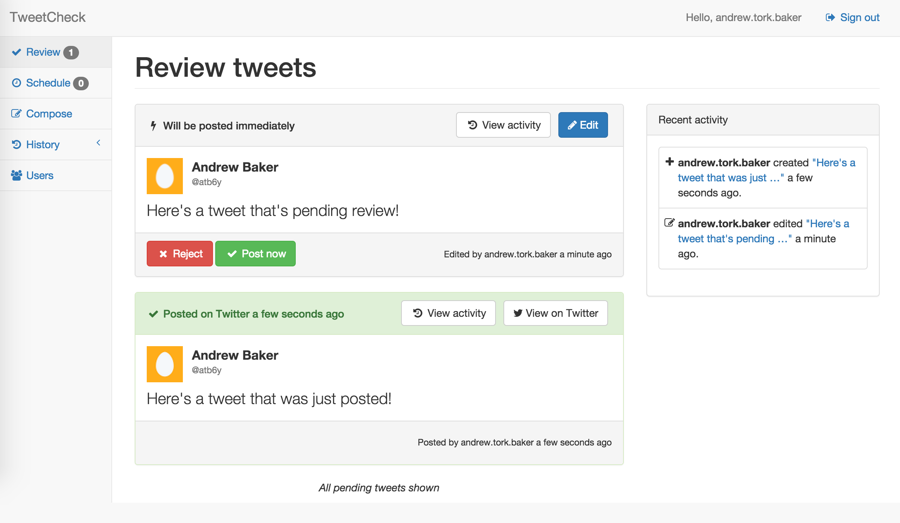

TweetCheck
==========

[](https://circleci.com/gh/atbaker/tweetcheck)

A dead-simple review process for your organization's tweets. Check it out yourself at https://www.tweetcheck.com

<p align="center">
    
</p>

## Background

TweetCheck is a product I built in Fall 2014, primarily to help me learn [AngularJS](https://angularjs.org/) and [Ionic](http://ionicframework.com/).

It was inspired by [this incident](http://time.com/3145199/think-tank-says-its-sorry-for-telling-amnesty-international-to-suck-it-on-twitter/), in which an intern at a prominent DC think tank accidentally used his employer's Twitter account when insulting an international human rights organization.

Many commercial tools already exist for helping organizations plan and moderate their Tweets, but building a simple solution to this problem seemed like a good fit for the technologies I wanted to learn.

You can read more about TweetCheck's origins in [this presentation](http://slides.com/atbaker/trackmaven-monthly-challenge-demo-tweetcheck-ionic-app#/) I gave at [DC's Monthly Challenge](http://www.meetup.com/TrackMaven-Monthly-Challenge/) meetup.

## Features

TweetCheck's core feature is holding tweets for moderation until an "approver" releases it to be posted to the organization's Twitter handle.

TweetCheck has a few other features as well:

- Tweets can be scheduled to be posted at any time in the future (still subject to approval)
- New tweets are automatically loaded in realtime on the dashboard as soon as they are submitted
- The ability to use multiple Twitter handles within an organization
- Some simple features for auditing TweetCheck activity, showing tweet history and activity history
- Minimal user management features to allow the first user for an organization to invite (and disable) other users they work with
- The dashboard is responsive so it can be used in mobile browsers

I also built a cross-platform native mobile app for TweetCheck, though that project needs more work before it is usable.

## Architecture

### Current stack

TweetCheck is composed of two main stacks: the backend stack which powers the TweetCheck API, and the frontend stack which serves the dashboard.

**Backend:**
- [Django](https://www.djangoproject.com/) + [Django REST Framework 3.0](http://www.django-rest-framework.org/) running on Python 3
- [Celery](http://celery.readthedocs.org/en/latest/) handles a few asynchronous tasks (mostly posting scheduled tweets)
- [PostgreSQL](http://www.postgresql.org/) for the database
- [Node.js](https://nodejs.org/) powers a very small web app to support the dashboard's websockets
- [Redis](http://redis.io/) serves as the message broker and communicates realtime updates between Django and Node
- [Nginx](http://nginx.org/) is a reverse-proxy for the different backend components and serves the static files for the frontend components
- [Docker](https://www.docker.com/) is used for each process in the stack to provide consistency between environments


**Frontend:**
- [AngularJS](https://angularjs.org/) powers the dashboard
- [angular-ui-router](https://github.com/angular-ui/ui-router) is used to control the dashboard's state
- [socket.io](http://socket.io/) is used to handle client-side websocket functionality
- [Bootstrap](http://getbootstrap.com/css/) CSS was used for styling - with help from the [SB Admin 2](http://startbootstrap.com/template-overviews/sb-admin-2/) theme
- [Ionic](http://ionicframework.com/) was used to build the mobile apps

The site is currently hosted on [DigitalOcean](https://www.digitalocean.com/). [Mandrill](https://mandrillapp.com/) is used to send emails in production.

### Improvements

TweetCheck is no longer under active development. Since working on it, I have gained much more experience with Angular and Node through other projects.

If I picked up TweetCheck again, I would:

- Try to find an easier way to do websocket support without having to add a Node.js server to the stack (the Redis process would probably stay as my message broker for Celery)
- Use [Ionic's new push notification service](https://apps.ionic.io/landing/push). In the current code, I use [Amazon's Simple Notification Service (SNS)](http://aws.amazon.com/sns/) to accomplish the same end
- Create a custom Angular directive to display each pending Tweet card for better isolation and performance
- Write tests for the Angular code using tools like [Karma](http://karma-runner.github.io/), [Jasmine](http://jasmine.github.io/), and [Protractor](https://github.com/angular/protractor) - which I have used at my job this spring
- Figure out a better way to share the Angular app's build output with the Nginx container. Right now I have to rely on `volumes_from` and some symlinks, which feels a little hacky
- Add email notifications when new Tweets are pending for review
- Finish building out the Ionic app

## Quickstart

If you just want to try TweetCheck for yourself, I recommend going to https://www.tweetcheck.com. To use the service, you will need to:

1. Register an account (and a new organization) through the homepage
1. Activate that account through an email notification
1. Authorize a Twitter handle to use with TweetCheck

After that, you can draft tweets for review and then post them to your handle. You can also invite other users to join your organization as authors or approvers.

### Running TweetCheck locally

TweetCheck is configured to use [Docker](https://www.docker.com/) and [docker-compose](https://docs.docker.com/compose/) to make getting started easy.

Follow these instructions to run TweetCheck on your local development machine. If you want to actively develop TweetCheck, follow the instructions in the next section.

1. Install Docker and docker-compose if you haven't already
1. Clone this repository
1. Copy `.env_example` to `.env_prod`, and supply the correct API keys (email me if you want them)
1. Run `docker-compose -f docker-compose/prod.yml up -d`
1. Run two commands to migrate and configure the database:
  - `docker-compose -f docker-compose/prod.yml run django python manage.py migrate`
  - `docker-compose -f docker-compose/prod.yml run django python manage.py setup_initial_data`

If everything goes smoothly, you should see output like this:

```
Creating dockercompose_redis_1...
Creating dockercompose_node_1...
Creating dockercompose_data_1...
Creating dockercompose_db_1...
Creating dockercompose_celery_1...
Creating dockercompose_django_1...
Creating dockercompose_angular_1...
Creating dockercompose_nginx_1...
```

You can now access TweetCheck by going to [http://localhost](http://localhost) or [https://localhost](https://localhost). You can log in as admin@tweetcheck.com with the password `admin`.

This is also the technique used to deploy TweetCheck to production, using with [docker-machine](https://github.com/docker/machine).

A few things to keep in mind when running TweetCheck locally:
- If you are running Docker on Mac or Windows, you will need to use the result of your `boot2docker ip` command instead of localhost
- When you try to authorize a Twitter handle with TweetCheck, you will be redirected to tweetcheck.com, not localhost. To complete authorization, just replace the `tweetcheck.com` part of the callback URL with localhost (or your `boot2docker ip`)

### Developing for TweetCheck

Docker is also easiest way to actively develop on TweetCheck. Here's how to get started:

1. Install Docker and docker-compose if you haven't already
1. Clone the following repositories to the same parent directory on your machine:
  - https://github.com/atbaker/tweetcheck (this repo)
  - https://github.com/atbaker/tweetcheck-nginx
  - https://github.com/atbaker/tweetcheck-angular
  - https://github.com/atbaker/tweetcheck-node
1. Copy `.env_example` to `.env` and supply the correct API keys (email me for them)
1. Add the SSL certs for TweetCheck to a subdirectory called `certs` within the tweetcheck-nginx repo (email me for them)
1. Run `docker-compose up -d`
1. Run two commands to migrate and configure the database:
  - `docker-compose run django python manage.py migrate`
  - `docker-compose run django python manage.py setup_initial_data`

If everything worked correctly, you can run `docker-compose ps` to see your stack running:

```
        Name                      Command               State                     Ports
---------------------------------------------------------------------------------------------------------
tweetcheck_angular_1   echo Front-end container         Exit 0
tweetcheck_celery_1    celery -A config worker -- ...   Up       8000/tcp
tweetcheck_data_1      /docker-entrypoint.sh echo ...   Exit 0
tweetcheck_db_1        /docker-entrypoint.sh postgres   Up       5432/tcp
tweetcheck_django_1    gunicorn -c config/gunicor ...   Up       8000/tcp
tweetcheck_nginx_1     bash -c rm /usr/share/ngin ...   Up       0.0.0.0:8001->443/tcp, 0.0.0.0:8000->80/tcp
tweetcheck_node_1      npm start                        Up       3000/tcp
tweetcheck_redis_1     /entrypoint.sh redis-server      Up       6379/tcp
```

You can then access TweetCheck in your browser at [http://localhost:8000](http://localhost:8000). (Or your `boot2docker ip` address). You can log in as admin@tweetcheck.com with the password `admin`.

Through [Docker volumes](https://docs.docker.com/userguide/dockervolumes/), your source code is being shared with your running containers. So changes to the API or frontend code should be immediately evident without the need to rebuild your Docker images.

A few things you should know about developing for TweetCheck:
- If you are using Docker on Mac or Windows with VirtualBox, you may experience slower performance (especially with the `angular` service) because of [this open issue](https://github.com/boot2docker/boot2docker/issues/64)
- Emails for activating new users won't be sent - you can read them in the Django logs instead: `docker-compose logs django`

## Run the tests

TweetCheck's API currently has 87% code coverage. To run the tests yourself, first follow the instructions in the "Developing for TweetCheck" section above. Then run this command:

```
docker-compose run django coverage run manage.py test --settings=config.test
```

To generate an HTML report of code coverage, run `docker-compose run django coverage html`.

TweetCheck's API is also continuously tested through CircleCI: https://circleci.com/gh/atbaker/tweetcheck/
